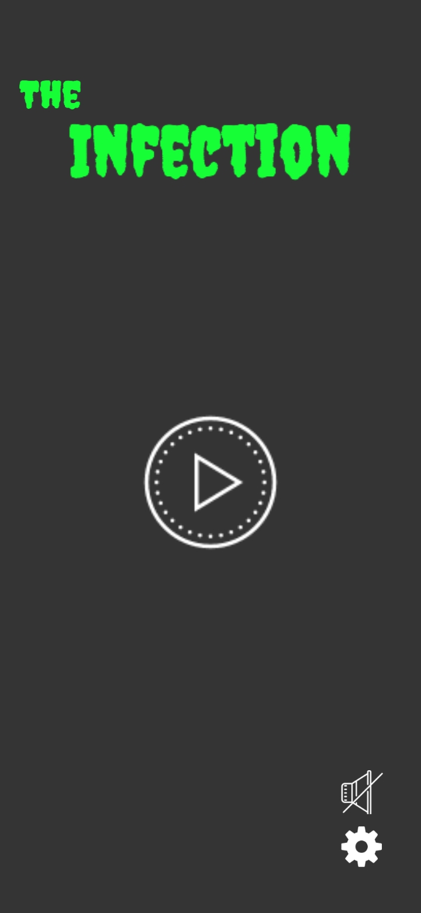
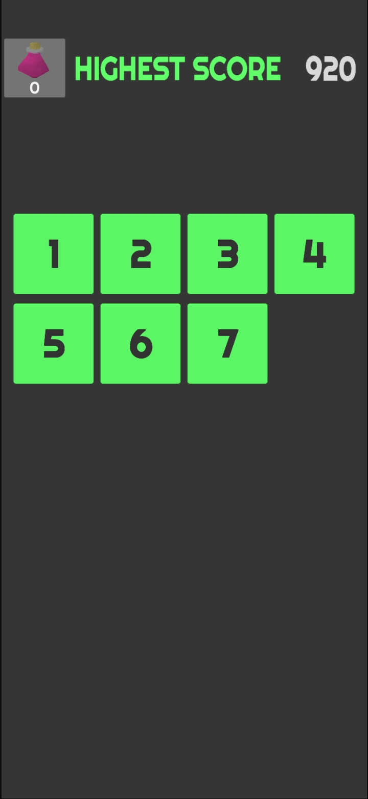
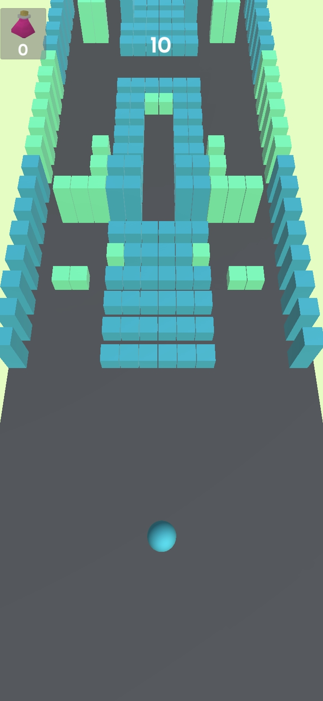
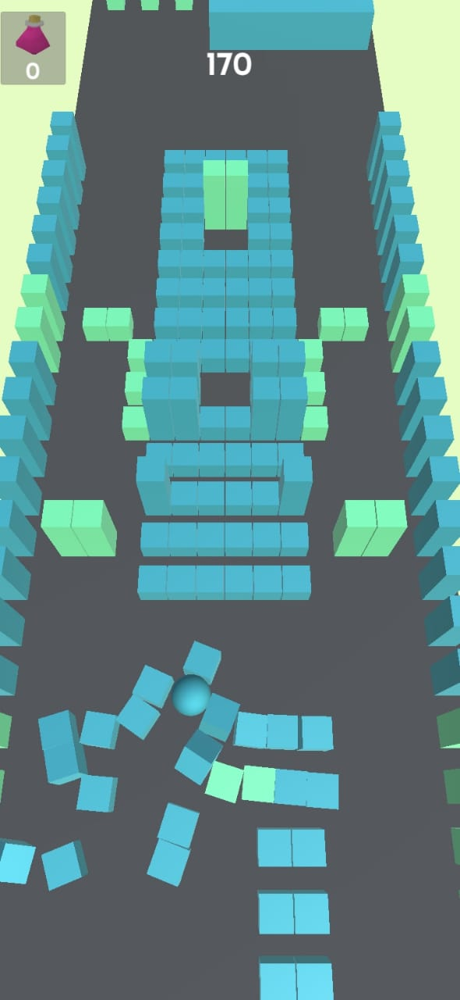
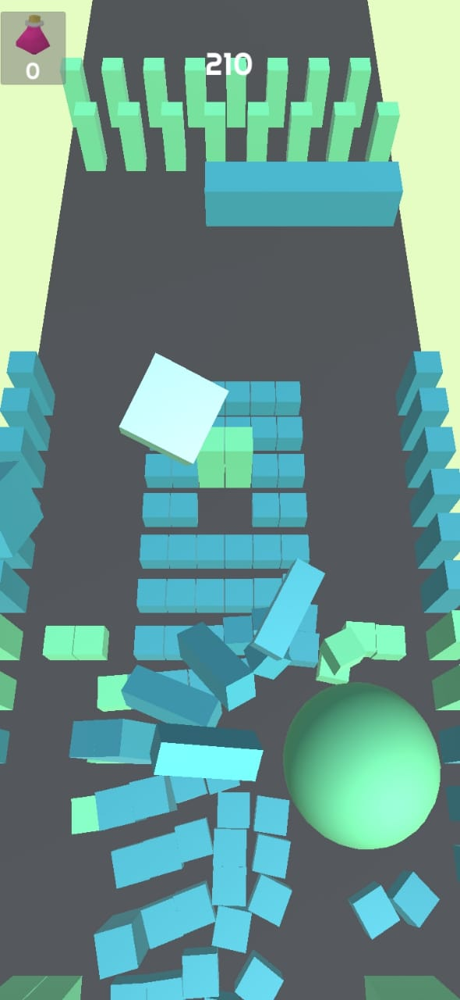

# Scenario generation
The scenario was created in a spreadsheet, the default size of scenario is 50x16, each level is a combination of 3 scenarios.

## How to create a new scenario
Inside the spreadsheet, copy the obstacle with its code and paste in the place you want, after creating the scenario in spreadsheet copy all the scenario, open the .html file 
inside js_preprocessing folder, paste into the input box and copy the result. This result will be paste in the code.

# Screens of the game

  Home Screen |  Level Screen  |    Game Screen
---|---|---
 |  |  
  Ball destroying the scenario |  Ball got infected  |
 |  | 